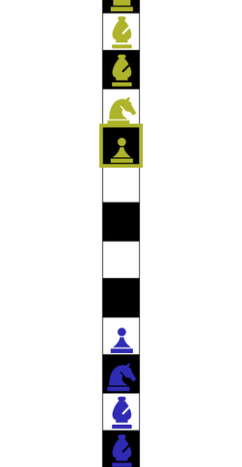
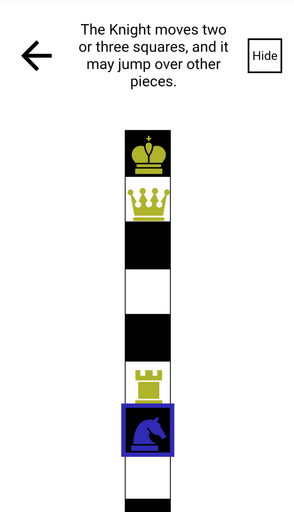

# One Dimensional Chess

This is a repository for Rachel Reilly's One Dimensional Chess React App.

Play the two-player game [here](https://one-d-chess.vercel.app/).

## Images

## How to Play

This version of one-dimensional chess uses Glimne's rules.

### Opening Setup

White King, Queen, Rook, Bishop, Bishop, Knight, Pawn, four empty squares, Black Pawn, Knight, Bishop, Bishop, Rook, Queen, King

### The Rules

> The King moves one or two squares, but moving two it may not jump over a piece.

> A Rook moves as usual.

> A Bishop moves an even number of squares (i.e. only on squares of his own color), and jumps over squares of the other color, e.g., when white starts the game with moving his pawn, he can move the next turn the bishop that is most towards the black pieces.

> The Queen has the combined moves of bishop and rook.

> A Knight moves two or three squares, and may jump over other pieces.

> A pawn moves one square, but may move two on its first move. Pawns (and all other pieces) take as they move.

> Castling is allowed under the same restrictions as castling in usual chess.

> The inventor thinks that white can force a win.

> from [The Chess Variants](https://www.chessvariants.com/shape.dir/onedim.html)
