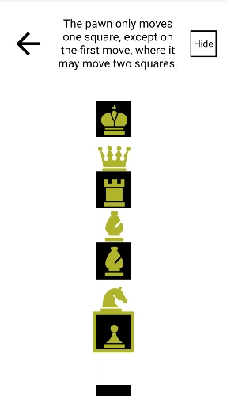

# One Dimensional Chess

This is a repository for Rachel Reilly's static One Dimensional Chess game. This game was built using React.js and CSS3.

Play the two-player game [here](https://one-d-chess.vercel.app/).

Read my [Medium post](https://rachanastasia.medium.com/usestate-vs-usereducer-9bbfca768f51) about using the useReducer hook in this project!

## Images

 

## Codebase

### Components

#### board

- Board.js
- GameWrapper.js
- Instructions.js (displays moves for selected piece)
- Piece.js (takes in an icon rendered through custom hook)
- ReviewGame.js
- Square.js (renders individual square and wraps piece)

#### landing-page

- About.js
- Header.js
- JumpingPawn.js
- LandingPage.js

### Contexts

#### GameContext.js

This file has both the context instance and a component rendering the context provier that wraps index.js.

The context contains a useReducer() hook that calls JavaScript to validate the movement of each piece. The reducer state includes the current board and current player turn. The dispatch is the name of the piece.

GameContext also houses the state of the currently selected piece.

### Hooks

#### useGetFocus()

This hook gets the first focusable piece of the current player by looping over the board and finding the piece farthest from the player's starting side. It is called in GameContextProvider and sets the active value after a move.

#### useGetPiece()

The SVG icons for each piece are imported and rendered through this hook. It is called from Square.js based on the current board state.

#### useGetPieceInstructions()

Similar to useGetPiece() but renders the instructions for each piece.

#### useWindowSize() (inactive)

Switches the orientation of the board based on aspect ratio.

### Utils

#### utils.js

This file contains functions that control if a move is valid for a given piece. They are called from the reducer in GameContextProvider based on dispatch. All functions take in the board and a moveFrom and moveTo value and return a boolean value.

### CSS

#### globals.css

This file sets up all css vairables for the project

#### main.css

This is primarily composed of element-specific styles

#### Component-specific CSS

- About.css
- Board.css
- Header.css
- Instructions.css
- Review.css

## How to Play

This version of one-dimensional chess uses Glimne's rules.

Instructions for how each piece can move are at the top of the screen next to the back button. They can be hidden throughout the game.

### The Rules

> The King moves one or two squares, but moving two it may not jump over a piece.

> A Rook moves as usual.

> A Bishop moves an even number of squares (i.e. only on squares of his own color), and jumps over squares of the other color, e.g., when white starts the game with moving his pawn, he can move the next turn the bishop that is most towards the black pieces.

> The Queen has the combined moves of bishop and rook.

> A Knight moves two or three squares, and may jump over other pieces.

> A pawn moves one square, but may move two on its first move. Pawns (and all other pieces) take as they move.

> Castling is allowed under the same restrictions as castling in usual chess.

> The inventor thinks that white can force a win.

> from [The Chess Variants](https://www.chessvariants.com/shape.dir/onedim.html)
